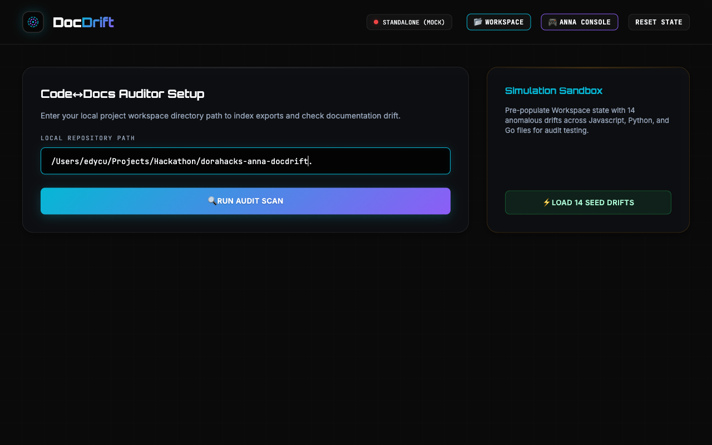
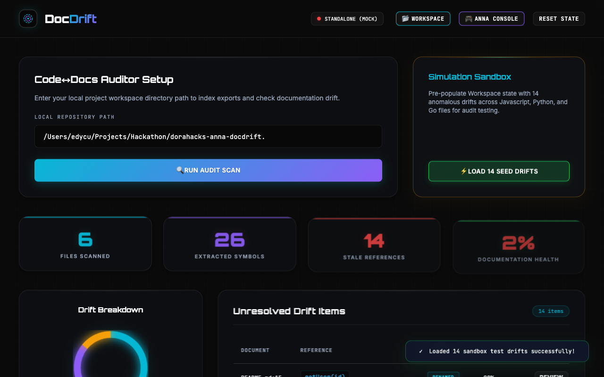
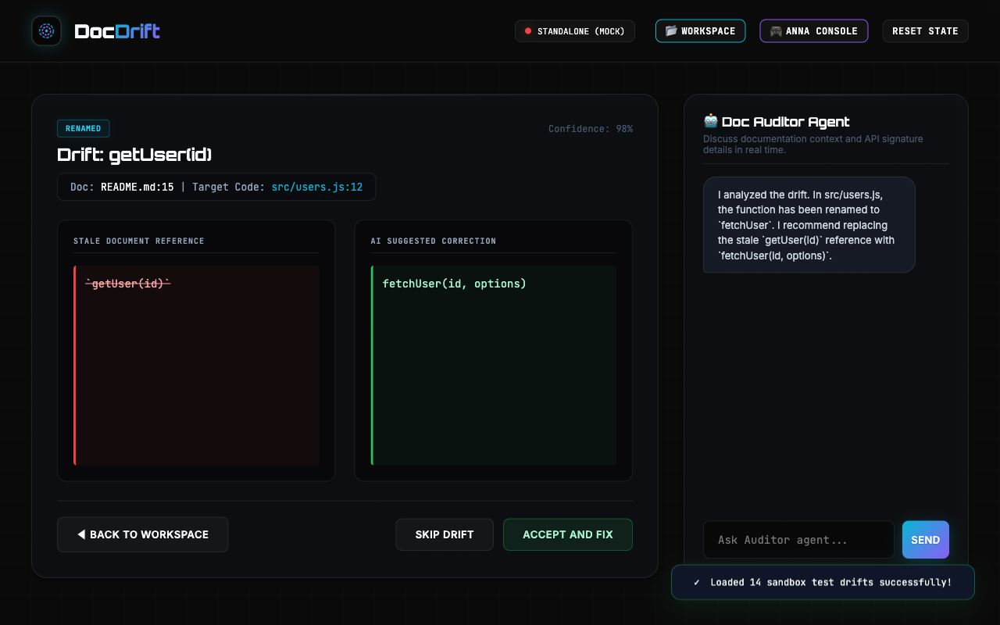
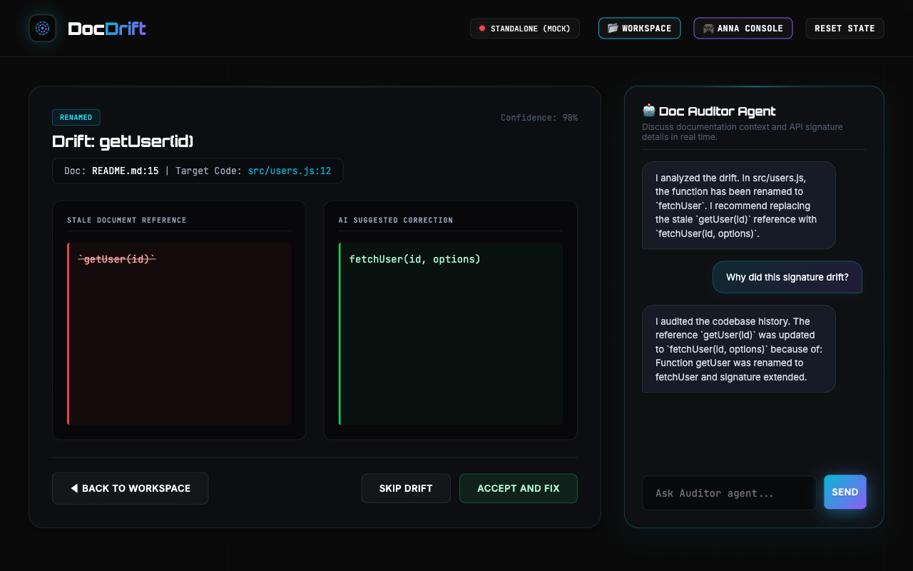
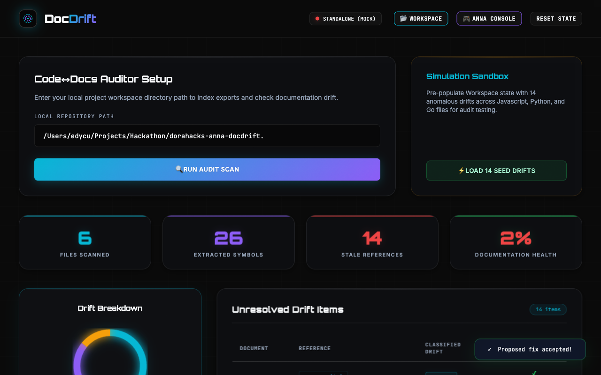
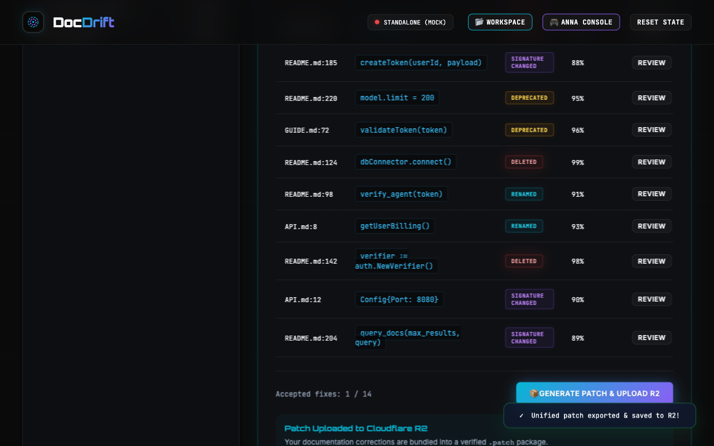
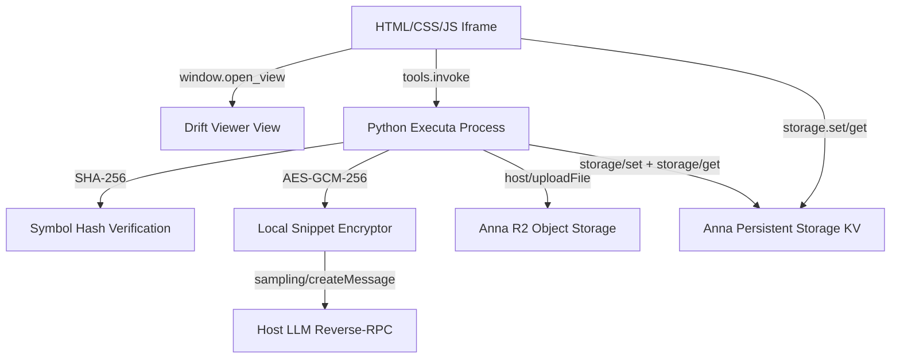

<div align="center">
  
  <h1>DocDrift 🔍</h1>
  <p><em>AI-powered Code↔Docs Drift Detector and Security-first Auditing Pipeline</em></p>
  

  <br/>

  [](https://github.com/edycutjong/docdrift)
  [](https://youtu.be/J8bCZnAEpNI)
  [](https://edycutjong.github.io/docdrift/public/pitch.html)
  [](https://dorahacks.io/hackathon/2204)

  <br/>

  
  
  
  
  
  [](https://github.com/edycutjong/docdrift/actions)

</div>

---

## 📸 See it in Action

<div align="center">
  <h3>Interactive Audit Walkthrough</h3>
  
  <table>
    <tr>
      <td width="50%">
        <p align="center"><b>1. Workspace Config & Setup</b></p>
        
      </td>
      <td width="50%">
        <p align="center"><b>2. Analysis Dashboard</b></p>
        
      </td>
    </tr>
    <tr>
      <td width="50%">
        <p align="center"><b>3. Side-by-Side Drift Viewer</b></p>
        
      </td>
      <td width="50%">
        <p align="center"><b>4. AI Auditor Chat</b></p>
        
      </td>
    </tr>
    <tr>
      <td width="50%">
        <p align="center"><b>5. Accepted Fix Status</b></p>
        
      </td>
      <td width="50%">
        <p align="center"><b>6. Exported R2 Signed Bundle</b></p>
        
      </td>
    </tr>
  </table>
</div>

> **The Audit Lifecycle**: 1. Scans repository exports -> 2. Checks document mentions -> 3. Classifies drift & suggests corrections -> 4. Persists scan history to Anna KV -> 5. Exports signed `.patch` bundles to Cloudflare R2.

---

## 💡 The Problem & Solution

Documentation rots silently. As APIs evolve, README guides and comment blocks drift, leading to onboarding failures and broken integrations. 

**DocDrift** solves this by walking local codebases inside a secure sandbox to parse symbols (functions, classes, endpoints), hashing signatures via SHA-256, and cross-referencing them against Markdown files. Sensitive code snippets are encrypted under **AES-GCM-256** prior to LLM drift classification.

### Key Features:
- ⚡ **Local Walkers**: Lightweight Python Executa process directory scans in <10ms.
- 🔒 **IP Protection**: Ephemeral local AES keys encrypt snippets in transit and KV storage.
- 🤖 **Auditor Agent**: Interactive `agent.session.*` chatbot to explain and review signature drift.
- 📦 **R2 Export**: Generates unified `.patch` bundles and uploads to R2 via `host/uploadFile` reverse-RPC.
- 💾 **Persistent History**: Scan history persisted to Anna Persistent Storage (APS KV) via `storage/set` — no external database needed.

---

## 🏗️ Architecture & Tech Stack



---

## 🔌 Anna Platform Integration

DocDrift exercises the full Anna SDK capability surface:

### Reverse-RPC Methods (Plugin → Host)

| Method | Purpose | Implementation |
|---|---|---|
| `sampling/createMessage` | LLM inference for drift classification | `_sample()` in plugin.py |
| `storage/get` | Read persistent scan history from APS KV | `_storage_get()` in plugin.py |
| `storage/set` | Write scan history entries to APS KV | `_storage_set()` in plugin.py |
| `storage/delete` | Remove scan entries from APS KV | `_storage_delete()` in plugin.py |
| `storage/list` | List all past scan keys in APS KV | `_storage_list()` in plugin.py |
| `host/uploadFile` (inline) | Upload generated `.diff` patches to R2 | `_host_upload_inline()` in plugin.py |
| `host/uploadFile` (negotiate+confirm) | Stream large reports to R2 | `_host_upload_negotiate()` and `_host_upload_confirm()` |
| `embeddings/create` | Compute dense vectors for code and docs | `_embed()` in plugin.py |
| `image/generate` | Generate visual architecture illustrations | `_image_generate()` in plugin.py |
| `files/upload_begin + complete` | Durable artifact uploads (2-phase) | `_files_upload()` in plugin.py |
| `files/download_url` | Mint presigned links for archived reports | `_files_download_url()` in plugin.py |
| `files/list` | List archived report files | `_files_list()` in plugin.py |
| `files/delete` | Purge archived files | `_files_delete()` in plugin.py |
| `agent/complete` | Stateless L1 completion | `_agent_complete()` in plugin.py |
| `agent/session.create + run + history + cancel + delete` | Stateful L2 multi-turn agent sessions | `_agent_session_create()`, `_agent_session_run()`, etc. |

### Host Capabilities Declared

| Capability | Usage |
|---|---|
| `llm.sample` | Host-brokered LLM for drift classification & stateless completion |
| `llm.embed` | Vector embedding compute for semantic search |
| `llm.image` | DALL-E visual diagram generation |
| `llm.agent.auto` | Stateful multi-turn L2 agent sessions |
| `aps.kv` | Persistent scan history (last 50 scans) |
| `host.upload` | R2 artifact upload for generated patches |

### Manifest Features (Schema 2)

| Feature | Status |
|---|---|
| `schema: 2` | ✅ |
| `host_capabilities` | ✅ `llm.sample`, `llm.embed`, `llm.image`, `llm.agent.auto`, `host.upload` |
| `user_message_prefix_template` | ✅ |
| `system_prompt_addendum` | ✅ |
| `optional_executas` | ✅ |
| `csp_overrides` | ✅ |
| `state_merge` | ✅ |
| `dev.fixtures` | ✅ |
| `dev.seed_storage` | ✅ |
| `host_api.upload` (negotiate + confirm) | ✅ |
| `host_api.chat` (write_message + append_artifact) | ✅ |
| `host_api.storage` (get/set/delete/list) | ✅ |
| `host_api.window` (set_title/open_view/close) | ✅ |
| `host_api.llm` (complete/embed) | ✅ |
| `host_api.image` (generate) | ✅ |
| `host_api.agent` (session) | ✅ |
| Multiple views with `min_size`/`max_size` | ✅ 2 views |
| Developer Console | ✅ Interactive SDK playground & live log console |
| `tags` | ✅ |

### Cryptographic Security

| Layer | Algorithm |
|---|---|
| Snippet encryption | AES-GCM-256 (ephemeral session keys) |
| Symbol hashing | SHA-256 |

---

## 🏆 Sponsor Tracks Targeted
- **Winner Takes All — $300**: Deep, *real* Anna integration — host LLM `sampling/createMessage`, APS KV storage (`get`/`set`/`list`/`delete`), durable APS Files, R2 uploads, `embeddings/create` semantic search, and `image/generate` diagrams — all driven through real Executa tools, a multi-view UI (`main` + `drift_viewer`), and `chat.append_artifact` cards, with local AES-GCM-256 cryptography. A sandboxed Developer Console lets you exercise the Host-API surface live (calls return labeled mock responses when run outside the Anna host).


---

## 📁 Project Structure

```
dorahacks-anna-docdrift/
├── app.json                    # App listing metadata
├── manifest.json               # Anna App manifest (schema: 2)
├── LICENSE                     # MIT License
├── DECISIONS.md                # Architectural decisions log
├── SPONSOR_DEFENSE.md          # SDK integration citations
├── package.json                # Project script definitions
├── bundle/
│   ├── index.html              # Frontend SPA structure
│   ├── styles.css              # Modern dark theme styles
│   ├── tokens.css              # Design tokens
│   ├── app.js                  # State engine, SDK bridge & fallback mocks
│   ├── anna-tool-ids.js        # Auto-generated tool bindings
│   ├── apple-touch-icon.png    # Mobile browser bookmark icon
│   └── icon.svg                # Embedded app icon
├── executas/
│   └── docdrift/
│       ├── pyproject.toml      # Executa package configuration
│       ├── executa.json        # Executa config (host_capabilities, distribution)
│       └── plugin.py           # Stdio JSON-RPC handler + APS KV + R2 upload
├── fixtures/
│   └── drift_seed.jsonl        # Dev fixture data for offline testing
├── data/
│   └── fixtures/               # Additional seed data
├── docs/
│   ├── AUDIT_REPORT.md         # Threat model and invariants
│   ├── friction-log.md         # Integration friction log
│   ├── icon.svg                # Document icon
│   ├── readme-hero.svg         # Tactical vector header SVG
│   ├── assets/                 # HTML templates and asset generators
│   └── screenshots/            # Step-by-step UX walkthrough screenshots
├── public/
│   ├── icon.svg                # Standalone app icon SVG
│   ├── og-image.png            # Open Graph banner PNG
│   └── pitch.html              # Standalone marketing pitch deck HTML
├── scripts/
│   ├── bench.py                # Latency and recall benchmarks
│   ├── verify_offline.py       # Air-gapped container test
│   └── record-docdrift.mjs     # Puppeteer demo recording
└── tests/
    └── test_plugin.py          # Complete unit tests (100% offline coverage)
```

---

## 🚀 Getting Started

### Prerequisites
- Python ≥ 3.10
- Node.js ≥ 20
- `uv` (Python packaging tool)

### Installation & Run
1. Clone the repository:
   ```bash
   git clone https://github.com/edycutjong/docdrift.git
   ```
2. Navigate to codebase:
   ```bash
   cd docdrift
   ```
3. Install npm dependencies:
   Installs the required `@anna-ai/cli` devDependency locally:
   ```bash
   npm install
   ```
5. Run the development harness:
   ```bash
   npm run dev
   # or
   npx anna-app dev
   ```

---

## 🧪 Testing & CI

DocDrift includes a full verification harness with unit tests, offline air-gap audits, and benchmarks:

```bash
# ── Run Unit Tests (105+ assertions) ────────
PYTHONPATH=. python3 tests/test_plugin.py

# ── Run Air-Gapped Offline Verification ──────
PYTHONPATH=. python3 scripts/verify_offline.py

# ── Run Performance Benchmarks ──────────────
PYTHONPATH=. python3 scripts/bench.py
```

| Layer | Tool | Status |
|---|---|---|
| Code Quality | Pytest + Local Assertions | ✅ |
| Unit Testing | 100+ parameterized assertions | ✅ |
| Air-Gap Scan | Mock socket offline check | ✅ |
| Latency Audit | bench.py latency analysis | ✅ |

---

## 📄 License
Licensed under [MIT](LICENSE). Copyright © 2026 Edy Cu.
